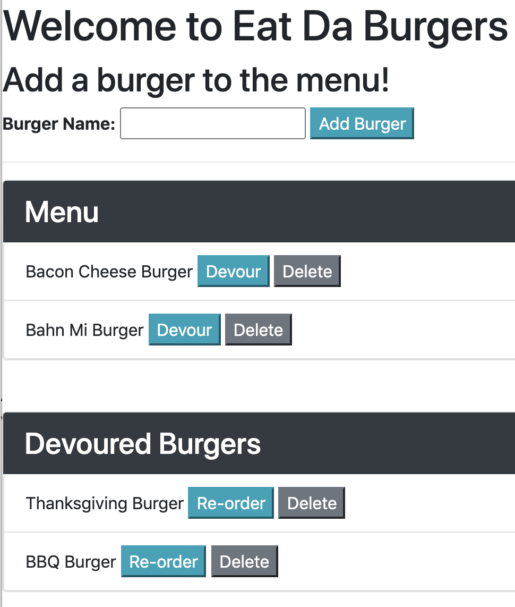

# mvc_burger

### Description
Use Eat-Da-Burger to track the burgers you have devoured. This burger tracker is built with MySQL, Node, Express, Handlebars and a ORM. A MVC design pattern was used leveraging MySQL to query and route data in the app, and Handlebars was used to generate the HTML.

### Deployed Application
Get started on tracking your favorite burgers! [Link to app in Heroku](https://pacific-anchorage-71530.herokuapp.com/).

## Burger Menu


### User Story
```
AS A user, I want to track the burgers I eat
SO THAT I know which burgers I have enjoyed and want to try again
```

### Acceptance Criteria
```
Application should allow users input the names of burgers they'd like to eat.
Application should allow users to users to submit a burger's name and will display the burger -- waiting to be devoured.
Application should allow users to users to update a burger from the menu to the devoured list.
Application should allow users to store every burger in a database, whether devoured or not.
Application should allow users to delete a burger from the database.
```

### Dependencies 
* [Express](https://www.npmjs.com/package/express)
* [Express-Handlebars](https://www.npmjs.com/package/express-handlebars
)
* [MySQL](https://www.npmjs.com/package/mysql)


### Contact
Melanie DeBarros
